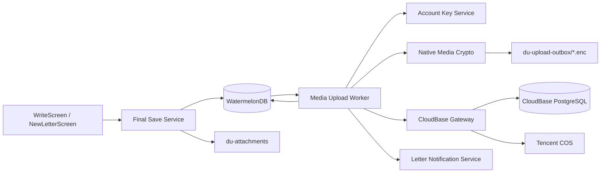
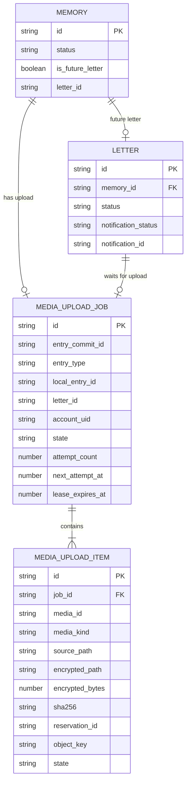
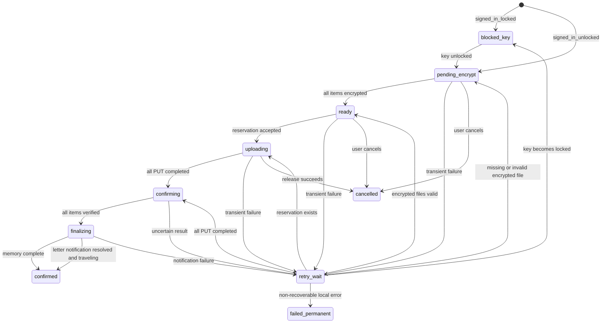
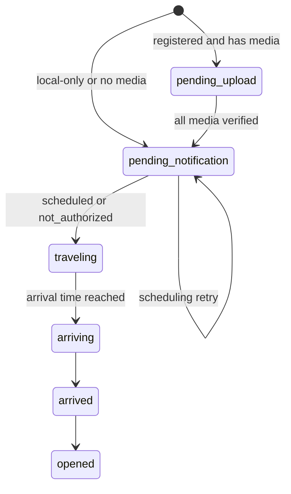
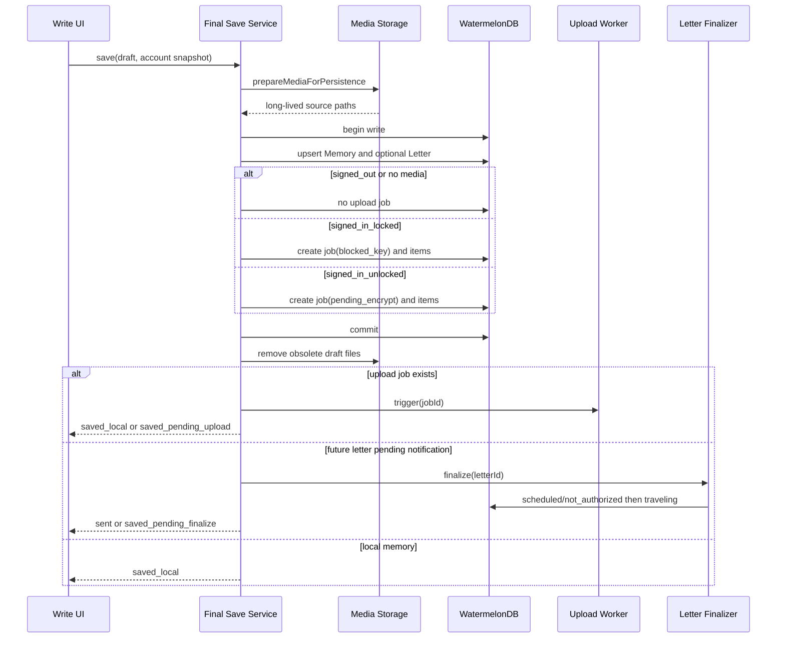
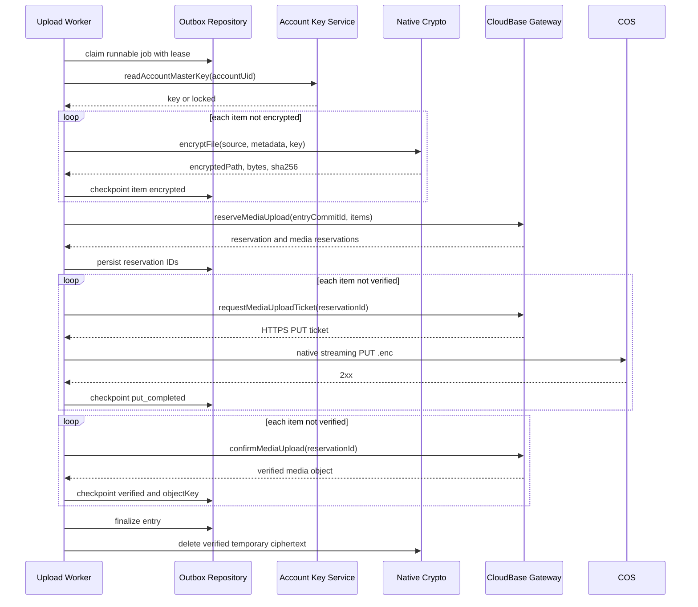

# 渡最终保存、媒体加密与上传 Outbox 设计

## 1. 设计范围

本文定义日迹与未来信点击“保存”或“寄出”后的本地事务、账号主密钥读取、媒体加密、持久化上传任务、失败恢复和最终确认。它是 `2026-09-02-account-sync-media-billing-design.md` 与现有 `reserve → ticket → PUT → confirm` 服务端链路之间的客户端设计层。`[Data-backed]`

当前实现使用 WatermelonDB schema 14，本地媒体先复制到 `du-attachments`，日迹立即写为 `published`，未来信立即写为 `traveling`；客户端已有上传预留协调器和原生文件 PUT，但没有主密钥读取 API、媒体加密实现或持久化上传队列。`[Data-backed]`

本设计覆盖：

- 已注册账号含媒体内容的本地保存、加密与上传。
- 未注册、已登录未解锁、已登录已解锁三种账号状态。
- 日迹与未来信不同的完成语义。
- WatermelonDB outbox、应用重启恢复和网络恢复重试。
- 真实账号密文上传验收。

本设计不覆盖：

- Apple、微信登录接入。
- 恢复凭证生成、可信设备交换和新设备主密钥恢复。
- 文字与结构化数据的完整增量同步协议。
- StoreKit、Play Billing、服务端验单和结算页面。
- 媒体下载、解密与跨设备恢复。

这些能力仍由上游规范约束，但不应与本阶段代码混合交付。`[Expert judgment]`

### 1.1 设计目标与硬约束

| 标识 | 目标或约束 | 来源 |
| --- | --- | --- |
| G1 | 保存操作先可靠写入本地，网络失败不得删除用户内容 | 上游本地优先与上传失败恢复要求 `[Data-backed]` |
| G2 | 云端和 COS 只能收到密文、密文元数据及同步索引 | 上游端到端加密要求 `[Data-backed]` |
| G3 | `signed_in_locked` 不得读取主密钥、生成密文或上传 | 账号安全模型 `[Data-backed]` |
| G4 | 大媒体不得整体进入 JavaScript 内存 | 现有原生流式 PUT 约束 `[Data-backed]` |
| G5 | 同一个保存操作在崩溃、超时和重试后只占用一次额度 | 服务端幂等预留与账本约束 `[Data-backed]` |
| G6 | 日迹本地保存完成即可阅读；上传状态不复用 `Memory.status` | 本地优先语义 `[Expert judgment]` |
| G7 | 含媒体的注册账号未来信在上传确认前不得显示为 `traveling` | 上游未来信一致性要求 `[Data-backed]` |
| G8 | 不在 React 状态、Zustand、AsyncStorage、日志或错误信息中保存主密钥 | 密钥最小暴露原则 `[Expert judgment]` |

### 1.2 关键术语

| 术语 | 含义 |
| --- | --- |
| Entry commit | 一次最终保存操作的稳定标识，也是服务端预留的幂等边界 |
| Upload job | 一篇日迹或未来信对应的持久化上传任务 |
| Upload item | Upload job 中的一份照片、录音或手书媒体 |
| Account master key | 每个账号独立的 256 位本地主密钥 |
| Encrypted media file | 由原生加密模块生成、只用于上传和恢复任务的 `.enc` 文件 |
| Terminal state | `confirmed`、`cancelled` 或 `failed_permanent`，任务不再自动执行 |

## 2. 系统架构

方案采用“本地事务 + 持久化 outbox”。界面只发起最终保存；仓储层在同一个 WatermelonDB 事务中写入业务记录和上传任务；后台执行器负责密钥门禁、原生加密、服务端预留、COS PUT 和确认。`[Expert judgment]`



图 1：最终保存和上传组件关系。保存服务拥有本地业务事务，不执行网络请求；上传执行器只消费已落盘任务，不直接修改编辑器状态。账号密钥服务只在单次原生调用期间返回受控密钥材料；原生加密模块从附件路径读取明文并流式写入临时密文。CloudBase Gateway 继续复用现有四个云函数，COS 只接收 `.enc` 文件。`[Expert judgment]`

### 2.1 模块边界

| 模块 | 单一职责 | 输入 | 输出 | 明确不负责 |
| --- | --- | --- | --- | --- |
| Final Save Service | 原子创建业务记录和 outbox | 编辑草稿、账号快照 | 本地记录、任务 ID | 加密、网络上传、重试 |
| Account Key Service | 按 UID 安全读写 32 字节主密钥 | UID、主密钥 | 短生命周期密钥结果 | 登录会话、恢复凭证 UI |
| Native Media Crypto | 流式生成并校验版本化密文文件 | 明文路径、主密钥、媒体元数据 | 密文路径、字节数、SHA-256 | 额度、上传、数据库状态 |
| Upload Job Repository | 保存任务、认领任务并执行合法状态转换 | 任务和 item 更新 | 可重试任务快照 | 网络和密码学 |
| Media Upload Worker | 编排单个任务直至确认或等待重试 | 可运行任务、账号和网络状态 | 状态变化、服务端副作用 | 编辑器导航、付费决策 |
| Letter Finalizer | 完成通知调度和寄出状态转换 | `pending_notification` Letter | `traveling` 或可重试错误 | 媒体上传 |

依赖方向为 UI → Final Save Service → Repository，Worker → Repository/Key/Crypto/Gateway/Notification；仓储层和密码学层互不依赖，避免形成循环。`[Expert judgment]`

### 2.2 运行触发

Worker 在以下事件尝试运行：本地保存提交后、应用启动恢复完成后、应用回到前台后、网络从不可用变为可用后、账号从 `signed_in_locked` 变为 `signed_in_unlocked` 后，以及用户手动重试后。Letter Finalizer 在保存后立即运行，并在应用启动和回到前台时扫描 `pending_notification` Letter；因此没有 upload job 的本地未来信也具备进程终止恢复路径。`[Expert judgment]`

移动操作系统不保证应用退到后台后持续执行，因此本阶段不承诺固定时间内完成上传。任务依靠持久化状态在下次可运行窗口继续；原生后台传输属于后续增强。`[Expert judgment]`

同一进程只允许一个 Worker 执行；任务通过带租约的认领字段防止重复运行。租约超时后可以由下一次触发重新认领。`[Expert judgment]`

## 3. 账号主密钥与媒体密文

### 3.1 Keychain 契约

主密钥继续使用服务名 `cn.du.app.account-master-key.{uid}`。Keychain 记录的 `username` 必须等于 UID，`password` 保存 base64 编码的 32 字节随机密钥。读取后必须完成 base64 规范性检查和 32 字节长度校验；记录不存在、UID 不匹配、解码失败或长度错误都返回 locked 结果，不得生成替代密钥覆盖旧记录。`[Expert judgment]`

| 操作 | 输入 | 成功结果 | 失败结果 |
| --- | --- | --- | --- |
| `generateAccountMasterKey` | UID | 32 字节 CSPRNG 密钥写入 Keychain | `KEYCHAIN_WRITE_FAILED` |
| `readAccountMasterKey` | UID | 受控的 32 字节密钥 | `KEY_NOT_FOUND`、`KEY_INVALID`、`KEYCHAIN_UNAVAILABLE` |
| `deleteLocalAccountMasterKey` | UID | 本机记录删除 | `KEYCHAIN_DELETE_FAILED` |
| `hasUnlockedAccountKey` | UID | 基于完整读取校验的 boolean | false |

`generateAccountMasterKey` 只允许在账号首次建立加密身份时调用。普通登录或会话恢复遇到缺失密钥时必须进入 `signed_in_locked`，否则会为同一账号生成第二把主密钥，使旧密文永久不可解。`[Expert judgment]`

JavaScript 调用结束后应尽快释放密钥引用；日志、遥测、错误对象和数据库不得包含密钥、派生密钥、盐以外的密码学材料。JavaScript 运行时无法保证内存立即清零，因此实现优先采用“Keychain 读取 + 单次原生加密调用”的窄接口，后续可把 Keychain 读取完全下沉到原生层。`[Expert judgment]`

### 3.2 版本化密文格式

媒体采用原生分块 AES-256-GCM，避免将完整文件载入 JavaScript 内存。每个媒体生成独立 32 字节随机 salt 和 8 字节随机 nonce prefix；通过 HKDF-SHA-256 从账号主密钥派生该媒体的 32 字节文件密钥。第 `i` 块使用 `noncePrefix || uint32be(i)` 组成 12 字节 GCM nonce。`[Expert judgment]`

iOS 原生模块使用系统 CryptoKit 完成 HKDF、逐块 AES-GCM 和流式 SHA-256；Android 原生模块使用平台 JCA 的 `HmacSHA256`、`AES/GCM/NoPadding` 和 `MessageDigest`。每次只在原生内存中保留一个明文块、一个密文块和小型状态，不新增 JavaScript AES 依赖，也不通过 React Native bridge 传输媒体字节。`[Expert judgment]`

两个平台共享同一组二进制格式测试向量。原生接口只暴露 `encryptFile`、`inspectEncryptedFile` 和 `deleteEncryptedFile`，防止平台实现细节进入业务层。`[Expert judgment]`

密文格式 `DUEM v1`：

```text
Header
  magic             4 bytes   "DUEM"
  version           1 byte    0x01
  algorithm         1 byte    AES-256-GCM + HKDF-SHA-256
  chunk_size        4 bytes   unsigned big-endian
  plaintext_bytes   8 bytes   unsigned big-endian
  salt             32 bytes
  nonce_prefix      8 bytes

Repeated Chunk Record
  plaintext_length  4 bytes   unsigned big-endian
  ciphertext        N bytes
  auth_tag          16 bytes
```

派生信息为固定域分隔符 `du-media-v1` 加 `uid`、`mediaId` 和 `mediaKind` 的长度前缀编码。每块 AAD 绑定完整 header、`entryCommitId`、`mediaId`、`mediaKind`、块序号和本块明文字节数。这样可以检测 header、顺序、截断、替换和跨记录挪用。`[Expert judgment]`

默认 chunk size 在实现前通过 iOS 与 Android 基准测试确定，候选值为 1 MiB；格式允许每个文件记录自己的 chunk size，因此调整不会破坏既有密文。`[Hypothesis]`

临时密文目录为应用私有缓存下的 `du-upload-outbox/{jobId}/{mediaId}.enc`，并设置不参与系统备份。只有 item 到达 `verified`、任务被明确取消且服务端释放成功，或永久失败后用户确认删除任务时才能删除密文。原始附件始终保留在 `du-attachments`，不因上传失败或 outbox 清理而删除。`[Expert judgment]`

SHA-256 对完整 `.enc` 文件计算，`encryptedBytes` 取文件真实字节数。两者写入 item 后才允许请求预留；服务端仍通过 COS HEAD 校验同一字节数和 `x-cos-meta-sha256`。`[Data-backed]`

## 4. 本地数据模型

WatermelonDB schema 从 14 升至 15，新增 `media_upload_jobs`、`media_upload_items`，并为 `letters` 增加可选通知状态字段。新增表与业务记录在同一 `database.write` 中创建，构成本地事务边界。`[Expert judgment]`



图 2：本地保存记录与 outbox 的关系。一个 Memory 最多对应一个当前 entry commit 的 upload job；未来信 job 同时保存 `letter_id`，供确认后完成寄出。一个 job 至少包含一个 item。`[Expert judgment]`

### 4.1 `media_upload_jobs`

| 字段 | 类型 | 约束与用途 |
| --- | --- | --- |
| `entry_commit_id` | string | indexed；一次最终保存的稳定服务端幂等键 |
| `entry_type` | string | `memory` 或 `future_letter` |
| `local_entry_id` | string | indexed；Memory ID |
| `letter_id` | string optional | future letter 必填 |
| `account_uid` | string | indexed；任务只能由同一账号执行 |
| `state` | string | indexed；见状态机 |
| `attempt_count` | number | 已进入执行器的失败轮次 |
| `next_attempt_at` | number optional | indexed；下次自动重试时间 |
| `lease_owner` | string optional | 当前进程实例标识 |
| `lease_expires_at` | number optional | 任务认领租约 |
| `last_error_code` | string optional | 稳定错误码，不保存敏感原文 |
| `created_at` | number | 创建时间 |
| `updated_at` | number | 最近状态变化时间 |
| `confirmed_at` | number optional | 全部媒体确认时间 |

WatermelonDB 不提供业务唯一约束，因此仓储层必须在写事务内按 `entry_commit_id` 查询并复用现有任务。服务端幂等仍是最终防线；客户端唯一性不能替代服务端校验。`[Expert judgment]`

### 4.2 `media_upload_items`

| 字段 | 类型 | 约束与用途 |
| --- | --- | --- |
| `job_id` | string | indexed；所属 job |
| `media_id` | string | job 内稳定且唯一 |
| `media_kind` | string | `photo`、`audio` 或 `ink` |
| `source_path` | string | 本地长期附件路径 |
| `plaintext_bytes` | number | 加密前真实字节数 |
| `encrypted_path` | string optional | `.enc` 私有缓存路径 |
| `encrypted_bytes` | number optional | 完整密文真实字节数 |
| `sha256` | string optional | 64 位小写十六进制密文 hash |
| `reservation_id` | string optional | 服务端 reservation |
| `object_key` | string optional | 服务端生成的 COS key |
| `state` | string | indexed；`pending_encrypt`、`encrypted`、`put_completed`、`verified` |
| `created_at` | number | 创建时间 |
| `updated_at` | number | 最近状态变化时间 |

不持久化上传 URL 和请求头，因为它们短期有效且可通过同一 reservation 重签。`[Data-backed]`

### 4.3 Letter 增量字段

| 字段 | 类型 | 语义 |
| --- | --- | --- |
| `notification_status` | string optional | `pending`、`scheduled`、`not_authorized`、`failed` |
| `notification_id` | string optional | 当前固定为 `future-letter-{letterId}` |

旧记录字段为空时按既有状态处理，不回写历史通知。新未来信必须显式写入通知状态。用户拒绝通知权限是合法结果 `not_authorized`，不会阻止寄出；权限已授予但调度 API 报错则写为 `failed` 并重试。`[Expert judgment]`

## 5. 状态机

### 5.1 Upload job



图 3：任务只在完整持久化检查点之间转换。`confirming` 的网络超时不能自动释放服务端 reservation，因为确认可能已经成功；下一轮使用相同 reservation 和幂等键查询或再次确认。`[Data-backed]`

`put_completed` 只是客户端观察，不能证明 COS 对象已被服务端接受；只有 `media-confirm-upload` 返回 `verified` 才能把 item 标为 `verified`。所有 item 均 verified 后 job 才进入 `finalizing`。`[Data-backed]`

自动重试采用带随机抖动的指数退避：5 秒、30 秒、2 分钟、10 分钟、1 小时，之后保持 6 小时间隔；用户手动重试忽略 `next_attempt_at`。具体时间可在实现测试后调整。`[Expert judgment]`

以下错误不自动重试：源附件缺失、主密钥格式损坏、密文格式内部校验失败、任务账号与当前账号不一致。额度不足和需要购买属于业务阻塞，后续结算设计接管；本阶段不得把它误记为永久技术失败。`[Expert judgment]`

### 5.2 日迹状态

日迹在本地事务成功后继续使用 `Memory.status = published`。上传进度只显示自 upload job，不新增 `uploading`、`failed` 等 Memory 状态，避免日迹列表、详情和现有查询被网络状态污染。`[Expert judgment]`

上传失败时日迹仍可本地阅读和编辑。编辑已存在且尚未确认的日迹时，后续实现必须创建新的 entry commit，并先取消旧任务；已经 verified 的对象按后续同步版本和孤儿清理策略处理，不在本设计中直接覆盖。`[Expert judgment]`

### 5.3 未来信状态



图 4：含媒体且需要云端上传的未来信必须经过 `pending_upload`。未注册用户继续完整使用本地未来信，不创建上传任务；纯文字未来信也不等待媒体链路。两者在通知结果被记录后进入 `traveling`。`[Expert judgment]`

只有 `traveling` 才播放现有寄出成功动画并进入现有漂流列表。`pending_upload` 显示“待寄出”及重试入口，不使用“已寄出”文案。上传失败不删除 Memory 或 Letter。`[Expert judgment]`

## 6. 关键流程

### 6.1 最终保存



图 5：文件准备发生在数据库事务前，延续现有可回滚复制方式；业务记录和 outbox 必须在同一个 WatermelonDB 写事务提交。数据库失败时删除本次新复制的长期附件，数据库成功后才清理草稿文件。`[Data-backed]`

`completion kind` 区分 `saved_local`、`saved_pending_upload`、`saved_pending_finalize` 和 `sent`。日迹可在本地提交后返回 `saved_local`；注册账号含媒体的未来信返回 `saved_pending_upload`，不能触发现有寄出动画。无上传任务的未来信只有完成通知处理并转为 `traveling` 后才返回 `sent`；进程中断或调度失败时返回 `saved_pending_finalize`，由持久化 Letter 状态支持后续恢复。`[Expert judgment]`

### 6.2 加密与上传恢复



图 6：每个耗时或远程步骤后都写入检查点。进程在任意箭头后终止时，下一轮先验证数据库状态和文件是否存在，再从最近的安全检查点继续。`[Expert judgment]`

加密阶段发现已有 `.enc` 文件时，必须重新读取文件大小和 SHA-256，并与 item 中的元数据比较；一致才复用，否则删除后重新加密。reservation 已存在时不得生成新的 `entryCommitId`。票据过期只重签，不重新预留。`[Expert judgment]`

### 6.3 未来信最终完成

全部 item verified 后，Worker 先把 Letter 从 `pending_upload` 更新为 `pending_notification`，再调用 Letter Finalizer。没有上传任务的未来信在首次本地事务中直接写为 `pending_notification`。Letter Finalizer 读取通知权限：权限未授予时记录 `not_authorized`；权限已授予时调用 `scheduleLetterArrivalNotification`，成功后记录 `scheduled`。随后在一个 WatermelonDB 事务中把 Letter 更新为 `traveling`；若存在 upload job，同时把 job 更新为 `confirmed`。`[Expert judgment]`

系统通知调度与 WatermelonDB 无法组成跨系统原子事务。为消除“通知已创建但数据库仍 pending”的崩溃窗口，通知 ID 固定为 `future-letter-{letterId}`；重试前先查询该 ID，存在则视为已调度，不重复创建。`[Expert judgment]`

应用启动和回到前台时，Letter Finalizer 扫描全部 `pending_notification` Letter。该扫描不依赖 upload job，因此未注册用户、纯文字未来信和已完成媒体确认的未来信使用同一恢复机制。`[Expert judgment]`

## 7. 接口契约

### 7.1 客户端内部接口

| 接口 | 输入约束 | 成功结果 | 稳定错误 |
| --- | --- | --- | --- |
| `saveMemoryWithOutbox` | draft；账号状态快照 | Memory、可选 job ID、completion kind | `LOCAL_MEDIA_COPY_FAILED`、`LOCAL_TRANSACTION_FAILED` |
| `saveFutureLetterWithOutbox` | draft、到达时间、账号状态快照 | Memory、Letter、可选 job ID、completion kind | 上述错误及 `INVALID_ARRIVAL_DATE` |
| `readAccountMasterKey` | 非空 UID | 32 字节 key handle | `KEY_NOT_FOUND`、`KEY_INVALID`、`KEYCHAIN_UNAVAILABLE` |
| `encryptMediaFile` | 存在的 source path、UID、entryCommitId、mediaId、kind、key handle | path、encryptedBytes、sha256、formatVersion | `SOURCE_NOT_FOUND`、`ENCRYPTION_FAILED`、`OUTPUT_INVALID` |
| `runUploadJob` | job ID 或下一条可运行任务 | terminal 或 waiting 状态 | 只向仓储层写稳定错误码 |
| `finalizePendingLetter` | `pending_notification` Letter ID | `traveling` 或保持 pending | `NOTIFICATION_SCHEDULE_FAILED`、`LETTER_NOT_FOUND` |
| `retryUploadJob` | 当前账号拥有的非 terminal job ID | 新状态快照 | `JOB_NOT_FOUND`、`ACCOUNT_MISMATCH` |
| `cancelUploadJob` | 当前账号拥有且未 confirmed 的 job ID | `cancelled` | `REMOTE_RELEASE_UNCERTAIN`、`ALREADY_CONFIRMED` |

这些接口均为本地 TypeScript 或原生桥接操作，不是公共 HTTP API。密钥接口不得把 base64 字符串写入返回日志；加密接口必须只接受应用私有目录中的路径。`[Expert judgment]`

### 7.2 既有云函数

| 操作 | 请求关键字段 | 认证 | 幂等与恢复 |
| --- | --- | --- | --- |
| `media-reserve-upload` | `entryCommitId`、`entryType`、`localEntryId`、`idempotencyKey`、密文媒体元数据 | CloudBase 登录账号 | 相同 entry commit 返回同一预留 |
| `media-create-upload-ticket` | `reservationId`、`mediaId`、`bytes`、`sha256`、`contentType` | CloudBase 登录账号 | `ticketed` 可为同一 object key 重签 |
| COS `PUT` | `.enc` 字节流与签名 headers | 短期签名 URL | 同一 object key 可安全重传完整对象 |
| `media-confirm-upload` | `reservationId` | CloudBase 登录账号 | 重复确认返回 verified 对象 |
| `media-release-upload` | `entryCommitId`、`reason` | CloudBase 登录账号 | 重复释放不重复扣减账本 |

客户端不得构造 COS object key、修改服务端返回的 reservation 字节数，也不得在 confirm 结果不确定时调用 release。`[Data-backed]`

## 8. 失败处理与数据安全

| 场景 | 持久化结果 | 下一步 |
| --- | --- | --- |
| 本地附件复制失败 | 不写业务记录和 job | 留在编辑界面，可重试 |
| WatermelonDB 事务失败 | 回滚新复制附件 | 留在编辑界面，可重试 |
| 保存后应用被终止 | 业务记录与 job 同时存在 | 下次启动恢复 |
| 主密钥缺失 | job 为 `blocked_key` | 解锁后继续，不自动生成新 key |
| 加密中断 | 不提交该 item 的 encrypted 检查点 | 删除不完整 `.enc` 后重做 |
| reserve 前网络失败 | job `retry_wait` | 按退避重试 |
| reserve 后、PUT 前失败 | reservation ID 已持久化 | 重签 ticket 后继续 |
| 部分 PUT 失败 | 不进入 confirm 阶段 | 重传未完成 item |
| confirm 超时 | 保留 reservation 和密文 | 使用相同 reservation 再次 confirm |
| 额度不足 | job 保留业务阻塞状态 | 后续结算流程处理，纯文字不受影响 |
| 用户取消未确认任务 | 先请求服务端 release | release 明确成功后清理密文 |
| 当前登录 UID 改变 | 不认领其他 UID 的 job | 原账号重新登录后继续 |

日志只记录 job ID、状态、稳定错误码、尝试次数和耗时。不得记录正文、附件路径、完整 object key、签名 URL、请求头、主密钥或恢复凭证。开发环境可记录 object key 的不可逆短摘要以关联服务端日志。`[Expert judgment]`

临时密文不参与系统备份；原始长期附件沿用当前备份策略。只有密文上传完成并不代表跨设备恢复已经可用，仍需结构化密文同步、媒体下载和解密链路通过验收后才能更新正式产品宣称。`[Data-backed]`

## 9. 迁移、验证与交付边界

### 9.1 Schema 15 迁移

迁移只新增两张表和 Letter 可选字段，不修改既有 Memory/Letter 状态。旧未来信保持原状态；迁移不得为历史 `traveling` 记录反向创建上传任务，因为无法判断其账号归属、媒体是否应同步及当时主密钥。`[Expert judgment]`

发布 schema 15 前必须验证：

- schema、migration、models 和 `modelClasses` 同时包含两个新表。
- 从 schema 14 的真实数据库副本升级后，既有日迹、未来信和附件路径可读。
- migration 失败时应用仍走现有数据库初始化错误界面，不清库重建。
- 用户退出账号不会删除未完成 job；删除账号或明确清除本地数据才进入独立清理流程。

### 9.2 测试层次

单元测试覆盖主密钥格式、状态转换、退避、账号隔离、密文 header 解析和 nonce 派生边界。仓储测试覆盖业务记录与 outbox 同事务、未来信 `pending_upload`、幂等创建和 schema 14 → 15 升级。原生测试对固定测试向量验证 iOS 与 Android 生成的密文可互相解密，并覆盖截断、篡改、错 key 和大文件分块。`[Expert judgment]`

集成测试使用 mock gateway 覆盖：全部成功、第二个 PUT 失败、首个 confirm 超时、应用在每个检查点终止、ticket 过期重签、账号锁定与解锁、通知已创建但数据库未更新。`[Expert judgment]`

真实账号验收必须满足：

1. 使用开发环境真实邮箱或手机号账号登录并确认 `signed_in_unlocked`。
2. 保存一篇同时含照片、录音和手书的日迹，杀进程后重启，任务可继续。
3. COS 对象不是原文件格式，且对象开头符合 `DUEM v1` header。
4. `media_objects.upload_status = verified`，字节数和 SHA-256 与本地 `.enc` 一致。
5. `reserved_free_bytes` 正确归零，`free_media_used_bytes` 只增加一次。
6. 同一 job 重跑不会新增 reservation、重复计费或生成第二个 object key。
7. 含媒体未来信在确认前显示待寄出，确认和通知处理后才进入 `traveling`。
8. 未注册用户仍可本地保存同类内容，且不会调用任何上传云函数。
9. `signed_in_locked` 保存后任务停在 `blocked_key`，解锁前无加密或上传调用。

真实账号链路、iOS Simulator 和 Android 环境均通过前，本功能只能视为开发中能力。设计文档批准后再拆分实施计划；实施应按主密钥与原生加密、schema 15 与仓储、Worker 与恢复、保存界面、真实账号验收的顺序推进，并保持每个阶段独立提交。`[Expert judgment]`
